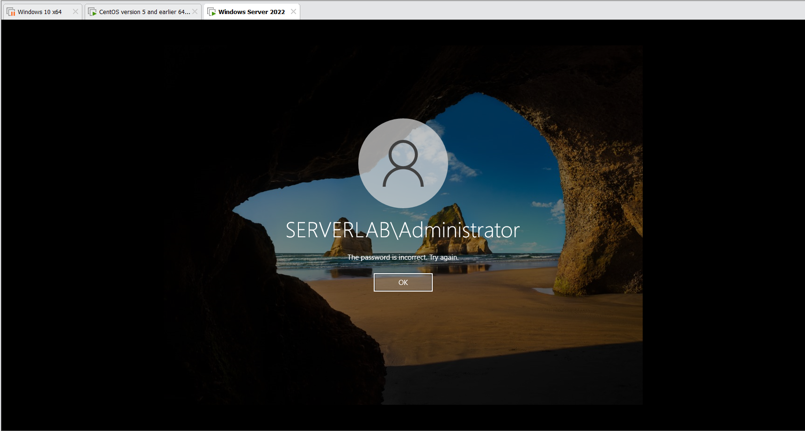
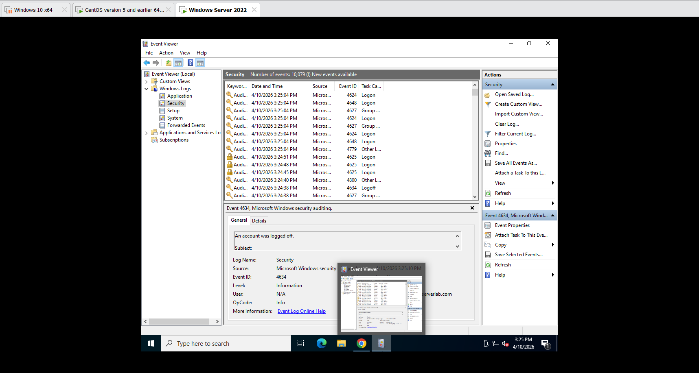
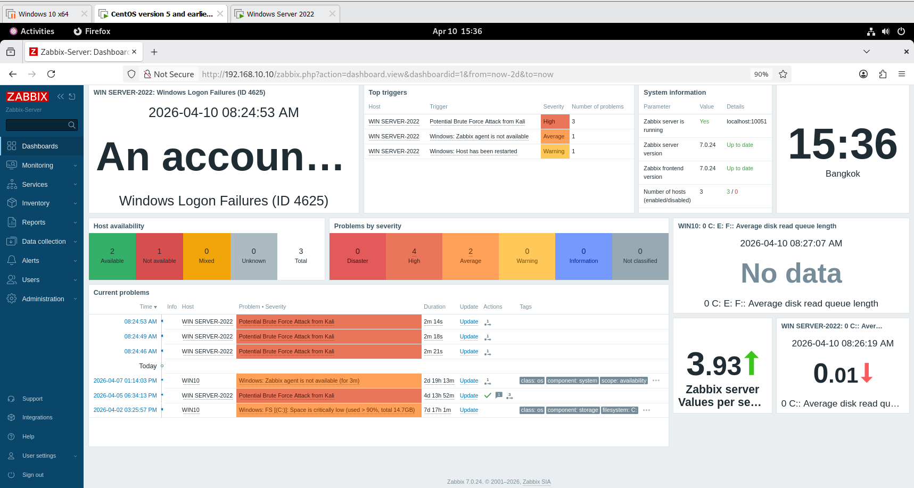
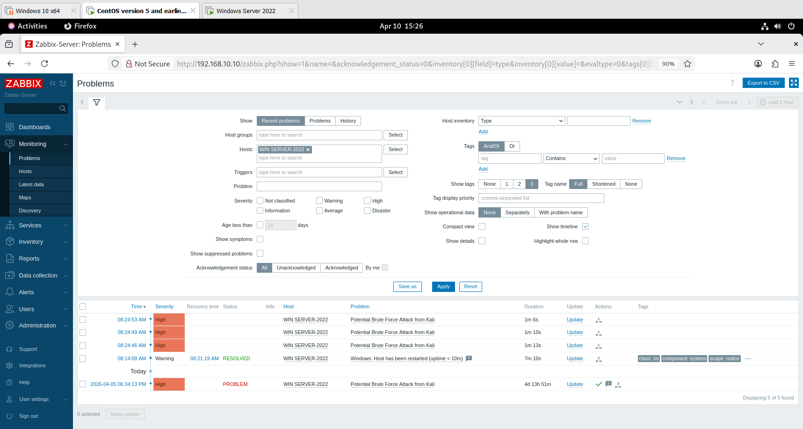
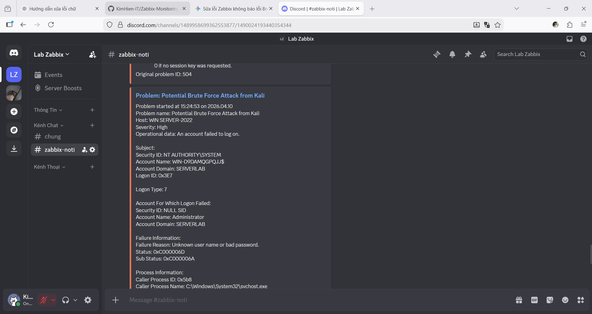

# Attack Simulation – Zabbix Security Monitoring Lab

## Objective

This simulation aims to test the ability of the monitoring system to detect unauthorized access attempts on Windows Server 2022.

---

## Attack Scenario

A brute-force login attack is simulated by repeatedly attempting to log in with incorrect credentials on the target system.

* Target: Windows Server 2022 (192.168.10.20)
* Attack Type: Brute-force login attempts
* Detection Method: Windows Security Event Log (Event ID 4625)

---

## Attack Execution

Steps performed:

1. Open Remote Desktop (RDP) or local login on Windows Server 2022
2. Enter incorrect username/password multiple times
3. Repeat the login attempts continuously

 

Expected behavior:

* Multiple failed login attempts are generated
* Event ID 4625 is logged in Windows Event Viewer

 

---

## Detection in Zabbix

Zabbix Agent collects Windows Event Logs and sends them to the Zabbix Server.

* Monitored Log: Security Log
* Event ID: 4625 (failed login)

 

Zabbix processes these logs and triggers an alert based on predefined conditions.

---

## Trigger Behavior

Trigger condition:

* Detect failed login events
* Alert when suspicious activity is observed

 

Result:

* Trigger status changes to PROBLEM
* Event is recorded in Zabbix dashboard

---

## Alerting

Once the trigger is activated:

* A notification is sent via Discord Webhook
* The alert contains:

  * Host name
  * Event description
  * Timestamp

 

---

## Result

The system successfully detected brute-force login attempts and generated real-time alerts.

Evidence:

* Windows Event Viewer shows multiple Event ID 4625 entries
* Zabbix dashboard displays triggered alerts
* Discord receives notification messages

---

## Analysis

The repeated failed login attempts indicate a potential brute-force attack.

This demonstrates that:

* The monitoring system can detect suspicious authentication activity
* Real-time alerting helps administrators respond quickly

---

## Conclusion

The attack simulation confirms that the Zabbix monitoring system is capable of detecting unauthorized access attempts and notifying administrators effectively.

