# 📖 Setup Guide – Zabbix Security Monitoring Lab

## 1. Environment Setup

* VMware Workstation
* 1 VM: CentOS Stream 9 (Zabbix Server)
* 2 VM:

  * Windows 10
  * Windows Server 2022

Each VM is configured with:

* NAT Adapter (Internet access)
* Host-only Adapter (Internal network)

---

## 2. Network Configuration

Configure IP addresses for internal communication:

| Machine             | IP Address    |
| ------------------- | ------------- |
| Zabbix Server       | 192.168.10.10 |
| Windows Server 2022 | 192.168.10.20 |
| Windows 10          | 192.168.10.30 |

Test connectivity using ping between machines.

Centos 9 ping to Windows Server 2022:
<p align="center">
 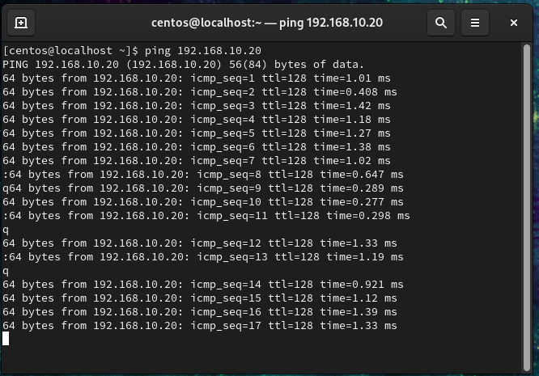
 </p>

 Centos 9 ping to Windows 10:
<p align="center">
 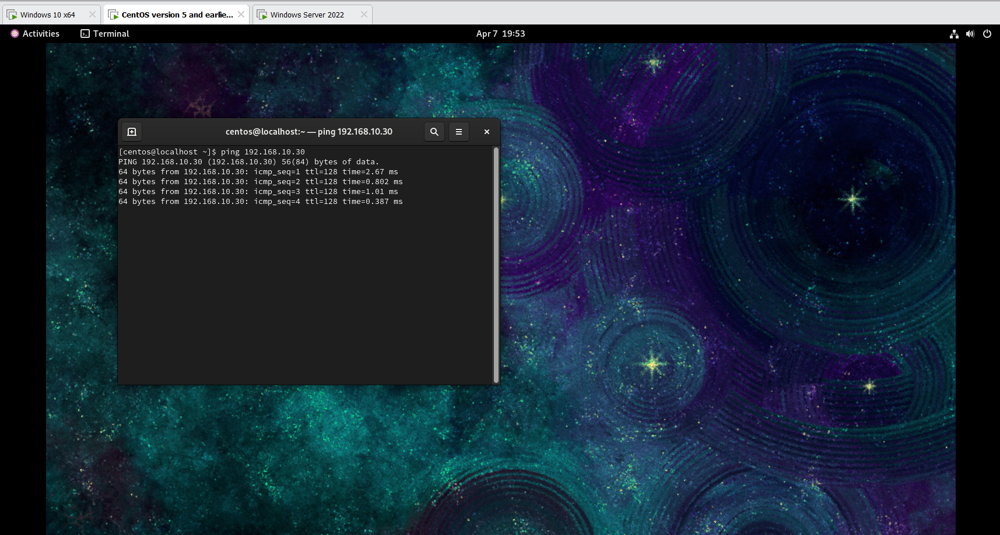
 </p>

Window 10 ping to Centos 9 and Windows Server 2022:
<p align="center">
 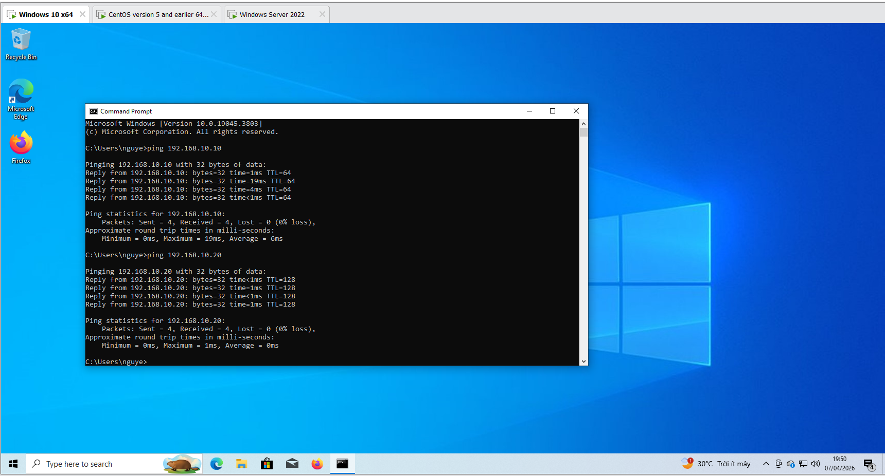
 </p>

 Window Server 2022 ping to Centos 9 and Windows 10:
<p align="center">
 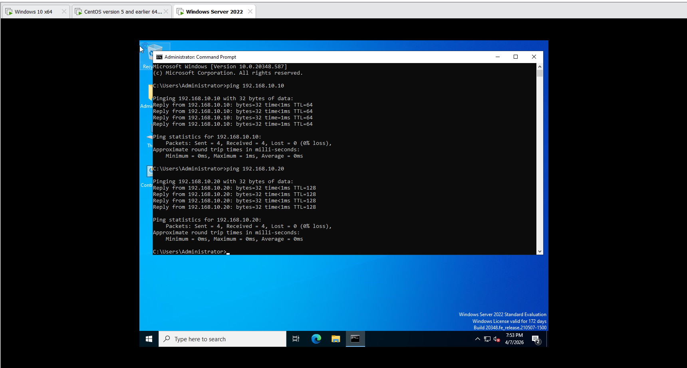
 </p>
---

## 3. Install Zabbix Server (CentOS 9)

Install Zabbix repository:
* rpm -Uvh https://repo.zabbix.com/zabbix/7.0/centos/9/x86_64/zabbix-release-latest-7.0.el9.noarch.rpm

Install packages:
* dnf install zabbix-server-mysql zabbix-web-mysql zabbix-nginx-conf zabbix-sql-scripts zabbix-selinux-policy zabbix-agent 

Setup database (MariaDB):
* mysql-uroot -p
* password
  * mysql> create database zabbix character set utf8mb4 collate utf8mb4_bin;
  * mysql> create user zabbix-sql@localhost identified by 'sql';
  * mysql> grant all privileges on zabbix.* to zabbix@localhost;
  * mysql> set global log_bin_trust_function_creators = 1;
  * mysql> quit; 
* Configure /etc/zabbix/zabbix_server.conf`

Start services:
  * zabbix-server: 
systemctl start Zabbix-server
  * zabbix-agent: 
systemctl start zabbix-agent

  * httpd / nginx

Access Web UI: "http://192.168.10.10\
<p align="center">
  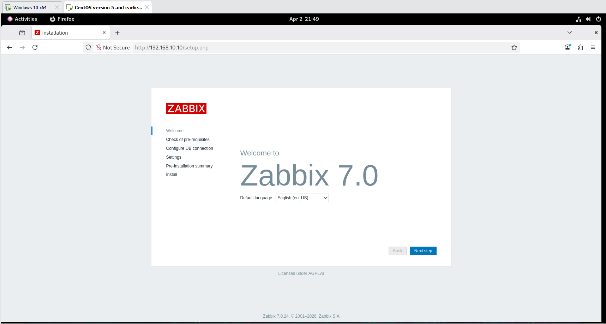
</p>
Setup SQL:
<p align="center">
 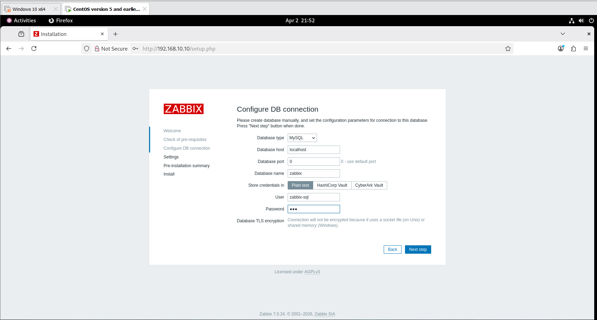
</p>
Setup Information:
<p align="center">
 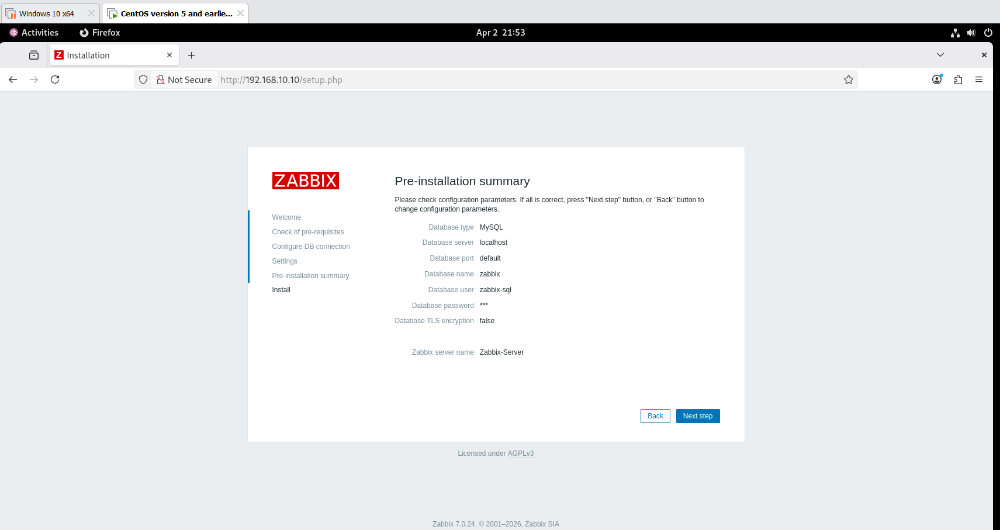
 </p>

## 4. Install Zabbix Agent (Windows)

* Download Zabbix Agent for Windows
* Install on:  https://cdn.zabbix.com/zabbix/binaries/stable/7.4/7.4.8/zabbix_agent-7.4.8-windows-amd64-openssl.msi

**Windows 10**

* Edit config file:
```

Server=192.168.10.10
ServerActive=192.168.10.10
Hostname=WIN10
```
**Windows Server 2022**

* Edit config file:

```
Server=192.168.10.10
ServerActive=192.168.10.10
Hostname=WIN SERVER-2022
```

* Start Zabbix Agent service.

---

## 5. Add Hosts to Zabbix

* Login to Zabbix Web UI
* Go to: Data collection -> Host -> Creat Host
  * Host: the name of the client machine.
  * Templates: a predefined set of monitoring items, triggers, and graphs applied to a host.
  * Host Group: a logical group of hosts for easier management and monitoring.
  * Interfaces: defines how the Zabbix server communicates with the host (e.g., Agent, SNMP, JMX, IPMI).
  * Description: provides additional information or notes about the host.
  * Monitored by: determines whether the host is monitored directly by the Zabbix server or through a proxy.
  **Windows 10:**
 Host: 
 <p align="center">
  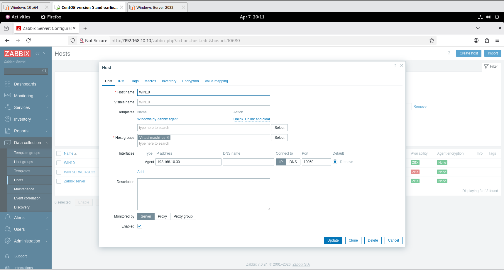
  </p>
  
  ** Windows Server 2022:**
 <p align="center">
  
  </p>

---

## 6. Basic Monitoring

Verify metrics:

* CPU usage
* Memory usage
* Disk usage
* Network traffic
<p align="center">
 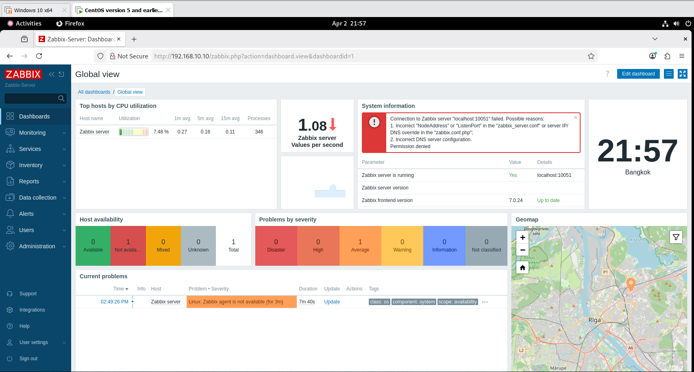
</p>
---

## 7. Configure Windows Event Log Monitoring

On Windows Server 2022:

* Enable Event Log monitoring via Zabbix Agent
 <p align="center">
  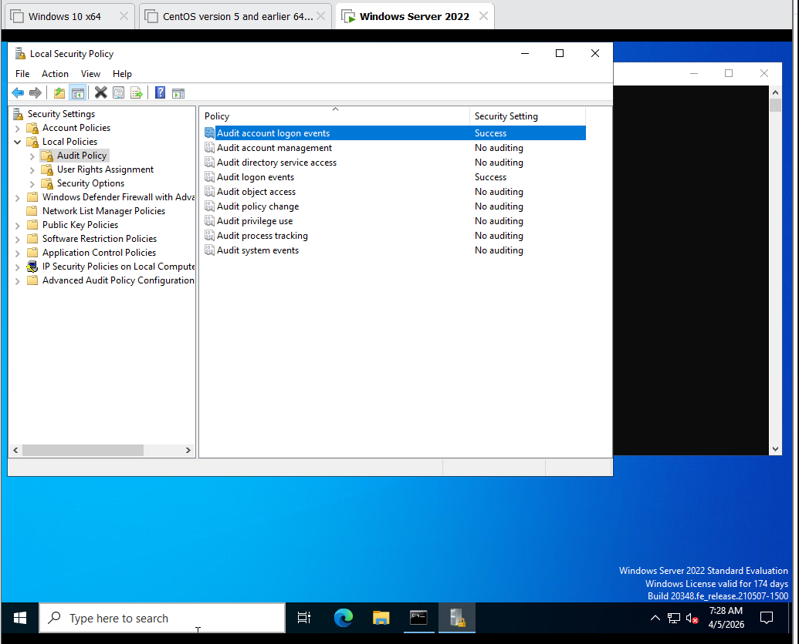
 </p>
Monitor:

  * Security Log:
  <p align="center">
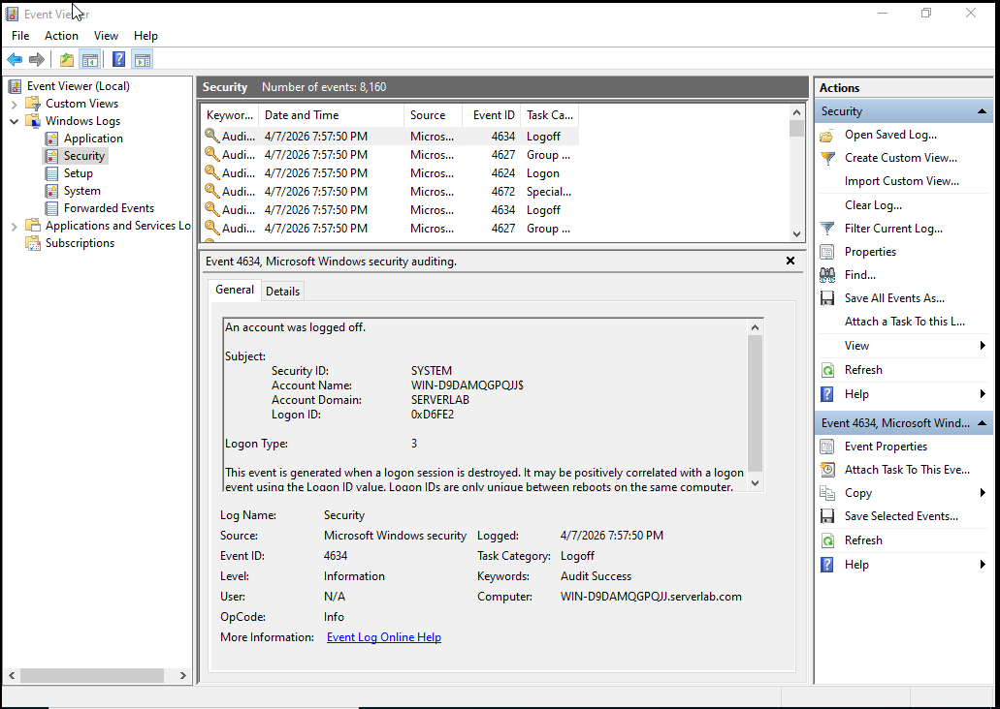
  </p>
Filter:
 Event ID: 4625 (Failed Login)

<p align="center">
 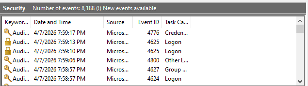
</p>
---

## 8. Create Trigger
<p align="center">
 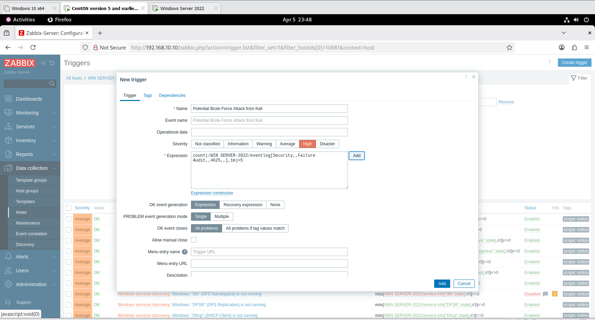
</p>
Create trigger condition:
<p align="center">
 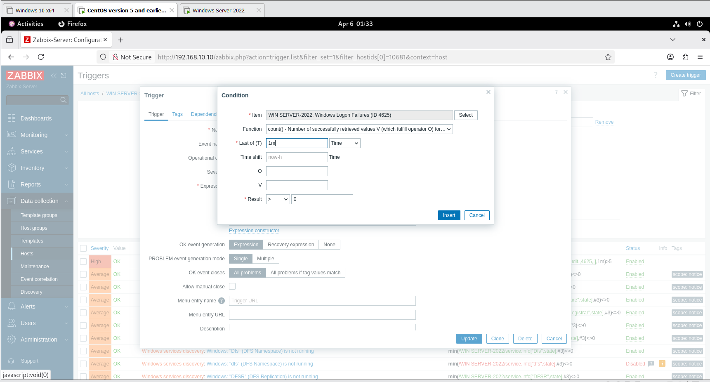
</p>
Create action:
<p align="center">
 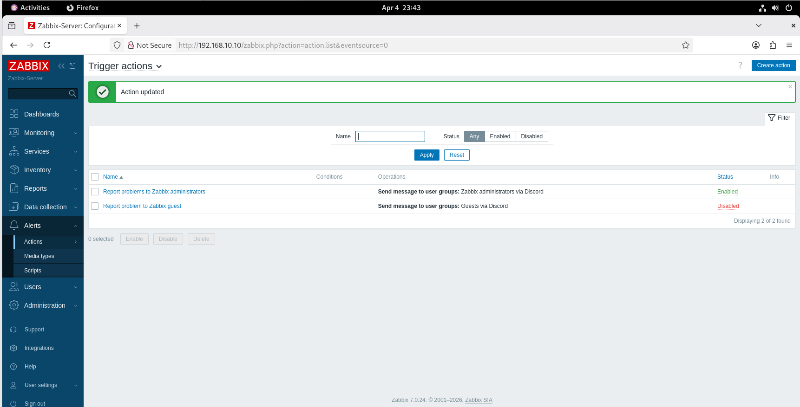
</p>
Create item:
<p align="center">
 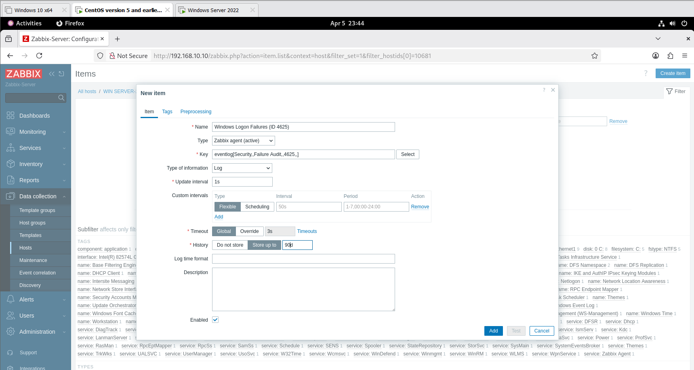
</p>

---

## 9. Configure Discord Alert

### Step 1: Create Webhook in Discord

* Go to Discord → Server Settings → Integrations → Webhooks
* Copy Webhook URL
<p align="center">
 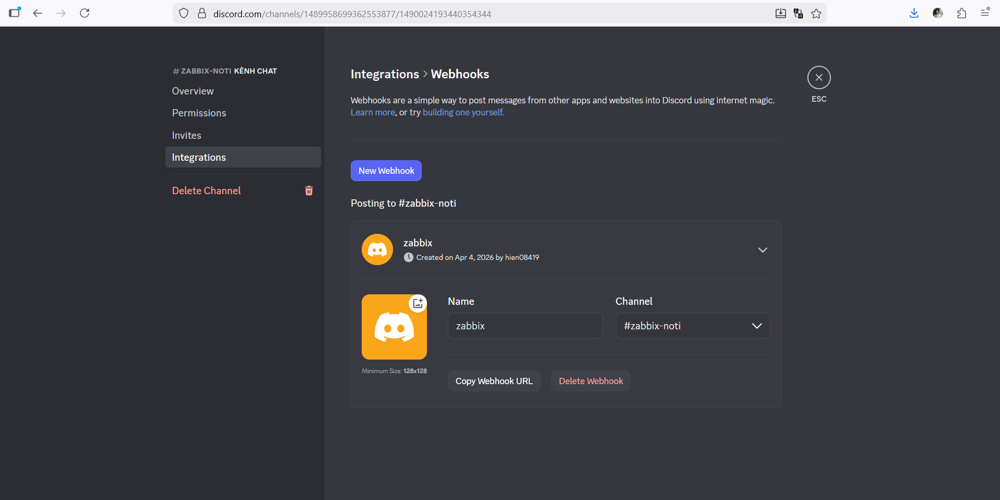
</p>
---

### Step 2: Configure in Zabbix

* Go to: Administration → Media types
* Create new Media type:

  * Type: Webhook
  * Paste Discord Webhook URL

---

### Step 3: Create Action

* Go to: Configuration → Actions
* Create trigger action:

  * Condition: Trigger = Failed Login
  * Operation: Send message to Discord

---

## 10. Testing

* Perform failed login on Windows Server 2022
* Result:

  * Event ID 4625 generated
  * Trigger activated
  * Alert sent to Discord

---

## ✅ Result

* Zabbix successfully monitors system performance
* Security events (failed login) are detected
* Real-time alerts are delivered via Discord

---

## 📌 Notes

* This lab simulates enterprise monitoring
* Network is implemented using VMware NAT + Host-only
* Security monitoring focuses on basic intrusion detection
