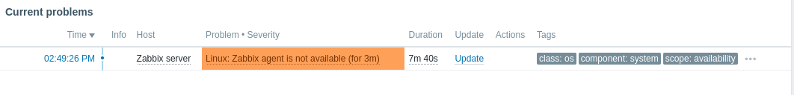
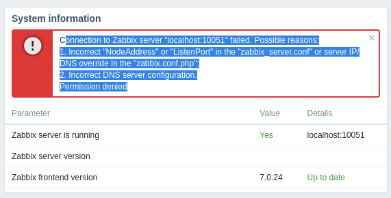
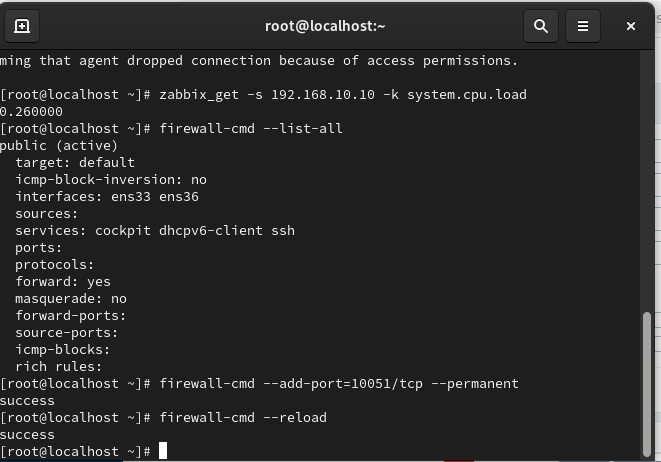
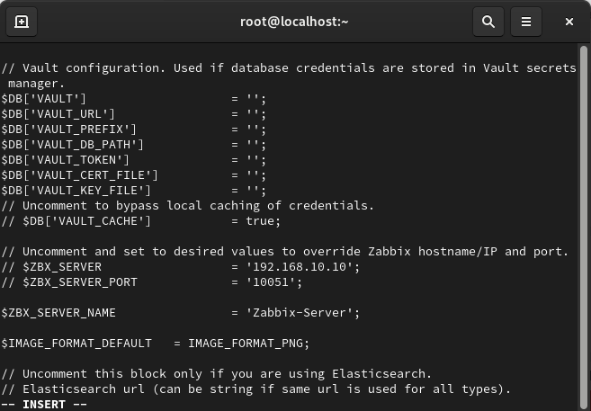

# Troubleshooting & Bug Fixes

During the development of this Zabbix Monitoring Lab, several issues were identified and resolved.

## 1. Zabbix Agent is not available (ZBX_TCP_READ failed)

   Issue: The dashboard shows "Linux: Zabbix agent is not available (for 3m)" with an orange alert.
   

   
   

   Cause: The Zabbix Agent service was either stopped, or the firewall (iptables/firewalld) was blocking port 10050.

   Solution: Restarted the Zabbix Agent service using systemctl restart zabbix-agent and allowed port 10050 through the firewall.
  
## 2. Zabbix Frontend: "Permission denied" to Zabbix Server

   Issue: A red error box appeared stating "Connection to Zabbix server 'localhost:10051' failed. Permission denied."
    
   

   
   

   Cause: SELinux (Security-Enhanced Linux) was blocking the Web Server (Apache/Nginx) from connecting to the Zabbix Server socket.

   Solution: Executed the command setsebool -P httpd_can_connect_zabbix on to allow the connection through SELinux.
    
   

   
   

   

   
   

## 3. Brute Force Trigger: Alert not clearing (Sticky Alerts)

   Issue: The first intrusion test triggered an alert, but subsequent tests did not send new notifications, and the old alert remained in "PROBLEM" status.

   Cause: The "PROBLEM event generation mode" was set to Single, meaning Zabbix won't create a new alert if the old one is still open.

   Solution: * Changed "PROBLEM event generation mode" to Multiple if continuous alerts are needed.

